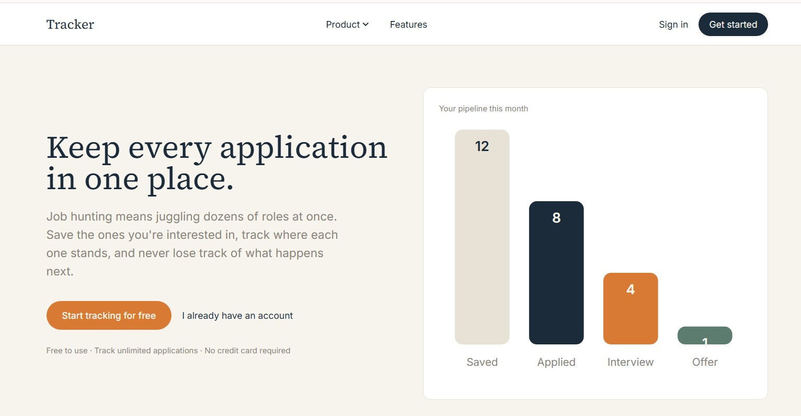

# Job Application Tracker (v2)



A secure job application tracker where users can save roles they're interested in, track progress on each one (Saved → Applied → Interview → Offer → Rejected), and keep private notes — built as a practical competency project.

This is a from-scratch rebuild of an earlier version of this project, scaffolded directly with `create-next-app` on Next.js 16 and Tailwind CSS v4, rather than migrated forward from an older version.

## Overview

Users sign up (via email/password, Google, or GitHub), then manage a personal list of jobs and their linked applications. Every operation is scoped to the logged-in user and enforced server-side — a user can never view or modify another user's jobs or applications, even by guessing or changing an ID.

## Tech Stack

- **Framework:** Next.js 16 (App Router, Turbopack) — frontend and backend in one project
- **Language:** TypeScript
- **Database:** PostgreSQL (hosted on [Neon](https://neon.tech))
- **ORM:** Drizzle ORM + `drizzle-kit` for schema and migrations
- **Auth:** [Better Auth](https://www.better-auth.com/) — email/password plus Google and GitHub OAuth, with account linking enabled
- **Validation:** Zod
- **Styling:** Tailwind CSS v4, custom design tokens defined via CSS `@theme` (serif/sans type pairing, warm paper palette)
- **UI runtime:** React 19
- **Linting:** ESLint 9 (flat config) with `eslint-config-next`

## Getting Started

### Prerequisites
- Node.js **20.9.0 or later** (required by Next.js 16)
- A PostgreSQL database (e.g. a free [Neon](https://neon.tech) project)
- A Google Cloud OAuth client and a GitHub OAuth App (for social login — see below)

### 1. Clone and install
```bash
git clone <your-repo-url>
cd job-application-tracker-v2
npm install
```

### 2. Configure environment variables
Create a `.env` file at the project root:

| Variable | Description |
|---|---|
| `DATABASE_URL` | PostgreSQL connection string |
| `BETTER_AUTH_SECRET` | Long random string. Generate with `node -e "console.log(require('crypto').randomBytes(32).toString('base64'))"` |
| `BETTER_AUTH_URL` | Base URL of the app, e.g. `http://localhost:3000` |
| `GOOGLE_CLIENT_ID` / `GOOGLE_CLIENT_SECRET` | From Google Cloud Console → APIs & Services → Credentials |
| `GITHUB_CLIENT_ID` / `GITHUB_CLIENT_SECRET` | From GitHub → Settings → Developer settings → OAuth Apps |

**Setting up Google OAuth:**
1. Create a project at [console.cloud.google.com](https://console.cloud.google.com)
2. Configure the OAuth consent screen (External, Testing mode is fine for local dev)
3. APIs & Services → Credentials → Create Credentials → OAuth client ID → Web application
4. Authorized JavaScript origin: `http://localhost:3000`
5. Authorized redirect URI: `http://localhost:3000/api/auth/callback/google`

**Setting up GitHub OAuth:**
1. [github.com/settings/developers](https://github.com/settings/developers) → New OAuth App
2. Homepage URL: `http://localhost:3000`
3. Authorization callback URL: `http://localhost:3000/api/auth/callback/github`

### 3. Set up the database
Generate and run the migration:
```bash
npx drizzle-kit generate
npx drizzle-kit migrate
```
This creates Better Auth's tables (`user`, `session`, `account`, `verification`) alongside the app's own `jobs` and `applications` tables.

### 4. Run the app
```bash
npm run dev
```
Visit `http://localhost:3000`.

### Other useful commands
```bash
npm run build            # production build (Turbopack)
npm start                # run the production build
npm run lint              # run ESLint (flat config)
npx drizzle-kit studio   # visual database browser
npx drizzle-kit generate # create a new migration after schema changes
```

## Database Schema

**user, session, account, verification** — managed automatically by Better Auth (see `lib/db/auth-schema.ts`, generated via `npx @better-auth/cli generate`).

**jobs**
| Column | Type | Notes |
|---|---|---|
| id | uuid | primary key |
| userId | text | foreign key → user.id, cascade delete |
| title | text | required |
| company | text | required |
| location | text | optional |
| url | text | optional |
| description | text | optional |
| createdAt | timestamp | |

**applications**
| Column | Type | Notes |
|---|---|---|
| id | uuid | primary key |
| jobId | uuid | foreign key → jobs.id, unique, cascade delete |
| userId | text | foreign key → user.id, cascade delete (denormalized from jobs.userId for simpler ownership checks) |
| status | enum | SAVED / APPLIED / INTERVIEW / OFFER / REJECTED |
| appliedDate | timestamp | optional |
| notes | text | optional |
| createdAt / updatedAt | timestamp | |

**Design note:** `jobs` and `applications` are separate tables with a one-to-one relationship (enforced via a `UNIQUE` constraint on `applications.jobId`), rather than one merged table. A job is information about a role; an application is the user's tracked progress on it. `applications.userId` is intentionally duplicated from the parent job's owner so that ownership checks on an application don't require an extra join back to `jobs`.

## API Reference

| Method | Endpoint | Auth required | Description |
|---|---|---|---|
| POST | `/api/auth/sign-up/email` | No | Register (also signs in automatically) |
| POST | `/api/auth/sign-in/email` | No | Sign in with email/password |
| POST | `/api/auth/sign-in/social` | No | Sign in with Google or GitHub |
| POST | `/api/auth/sign-out` | Yes | Clear session |
| GET | `/api/jobs` | Yes | List the logged-in user's jobs |
| POST | `/api/jobs` | Yes | Create a job |
| GET/PATCH/DELETE | `/api/jobs/:id` | Yes | View/update/delete a job (must be owned by requester) |
| GET | `/api/applications` | Yes | List the logged-in user's applications |
| POST | `/api/applications` | Yes | Create an application for a job the requester owns |
| GET/PATCH/DELETE | `/api/applications/:id` | Yes | View/update/delete an application (must be owned by requester) |

All Better Auth endpoints are handled by the single catch-all route at `app/api/auth/[...all]/route.ts`.

## Security Decisions

**Authentication.** Better Auth manages password hashing, session creation, and cookie handling internally. Sessions are stored in an **HttpOnly, SameSite=Lax** cookie — not `localStorage` — so a token can't be read via an XSS injection. Social login (Google/GitHub) uses standard OAuth 2.0 via Better Auth's built-in providers.

**Account linking.** `accountLinking` is enabled with `google` and `github` as trusted providers, so a user can sign in with email/password or either OAuth provider interchangeably once linked. Linking only happens automatically when the existing account's email is marked `emailVerified: true` — an account created via email/password starts as unverified, since this project doesn't implement an email-confirmation flow, so its first link to an OAuth provider using the same email will be blocked by Better Auth as a deliberate anti-hijacking safeguard. In production this would be resolved by building a real "confirm your email" flow; for this project's scope, it's a known, understood trade-off rather than a bug.

**Authorization.** Every job and application endpoint follows the same pattern: authenticate the request, fetch the record, then explicitly compare its `userId` against the requester's own id from the verified session — before allowing any read, update, or delete. Creating an application additionally checks ownership of the **linked job**, since an application can't be created for a job the requester doesn't own. A record that doesn't exist and a record that exists but belongs to someone else both return the same `404`, so no information about which IDs exist leaks to a user who doesn't own them.

**Validation.** All input is validated with Zod at the API layer — required fields, string length limits, valid URL format, and enum whitelisting for `status` — backed by native Postgres enum types and foreign key constraints as a database-level backstop.

**Route protection.** `proxy.ts` (Next.js 16's route-interception convention) checks for the presence of Better Auth's session cookie before rendering `/dashboard/*` pages, redirecting unauthenticated visitors to `/signin` before any page content loads. This is a fast, existence check, not full cryptographic verification — the actual security boundary is the API routes, which call `auth.api.getSession()` to fully verify the session against the database on every request.

**Error handling.** Every route wraps its logic in try/catch; unexpected errors are logged server-side but only a generic message is returned to the client — no stack traces or database details are ever exposed.

**Secrets.** `.env` is gitignored and never committed.

## Design Notes

The interface uses a warm, paper-and-ink palette (rather than a stark white/blue SaaS look) with a serif/sans type pairing — Source Serif 4 for headlines, Inter for UI text. The dashboard uses a persistent sidebar on desktop and a slide-out drawer on mobile. The public landing page includes a live SVG bar chart and donut chart built from the app's own status categories, rather than generic stock imagery.

## Project Structure
```
app/
├── api/
│   ├── auth/[...all]/route.ts   — Better Auth catch-all handler
│   ├── jobs/route.ts, jobs/[id]/route.ts
│   └── applications/route.ts, applications/[id]/route.ts
├── signup/page.tsx, signin/page.tsx
├── dashboard/
│   ├── layout.tsx    — sidebar/mobile-drawer shell, session check
│   ├── page.tsx       — job list with status badges
│   ├── new/page.tsx
│   └── [id]/page.tsx  — job detail + application tracking form
├── layout.tsx, page.tsx (landing page), globals.css   — globals.css holds the Tailwind v4 @theme design tokens
lib/
├── db/
│   ├── index.ts        — Drizzle client
│   ├── schema.ts        — jobs, applications
│   └── auth-schema.ts   — Better Auth's generated tables
├── auth.ts        — Better Auth server config (providers, adapter, account linking)
├── auth-client.ts — Better Auth client (signUp, signIn, signOut, useSession)
└── getSession.ts  — server-side session lookup for API routes
drizzle.config.ts
eslint.config.mjs   — ESLint 9 flat config (eslint-config-next)
proxy.ts            — session-cookie existence check for route protection
```
